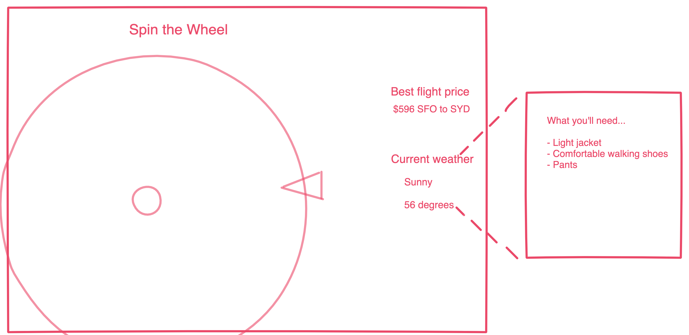

# Background

Gadabout is a travel app for the spontaneous and adventurous to choose their next destination. The user can set their destination preference to worldwide or restrict destinations to a specific continent. The user then spins a virtual roulette wheel to reveal their travel destination. Once the wheel lands, the app will display the best flight prices available within the last 48 hours and current weather. 

# Functionality & MVP
A user will be able to: 
Filter their destination preferences or set it to worldwide
Spin a roulette wheel with various destinations 
View current flight prices (based on their location) and current weather at the destination 
Display ‘what to pack’ recommendation on hover of current weather
This project will also include a production README.

# Wireframes 
This app will include a single screen. When the user first lands on the page, it will include a title, roulette wheel, filter option, spin button, and nav links to my Github, LinkedIn, and AngelList accounts. After the first spin, the page will display current flight prices and weather, along with packing recommendations on hover based on the current weather. 

# Architecture and Technologies 
This project will use the following technologies: 
* Javascript for filtering and logic
* Canvas for building the spin wheel 
* Dark Sky API for current weather 
* Flight Data API for current flight prices

# Timeline 
### Day 1: 
Render the basic wireframe and build the wheel with selected worldwide destinations
### Day 2: 
Add option for filtering and incorporate external APIs
### Day 3: 
Add logic and render for ‘what to pack’ based on current weather at destination
