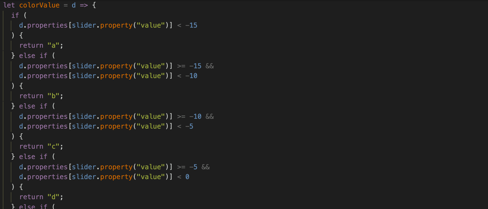
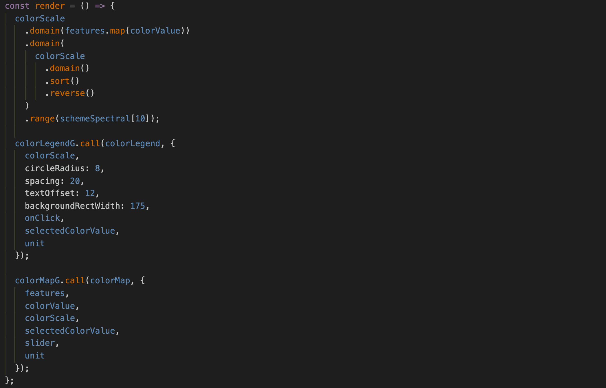
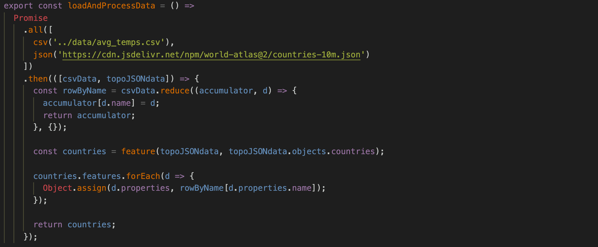
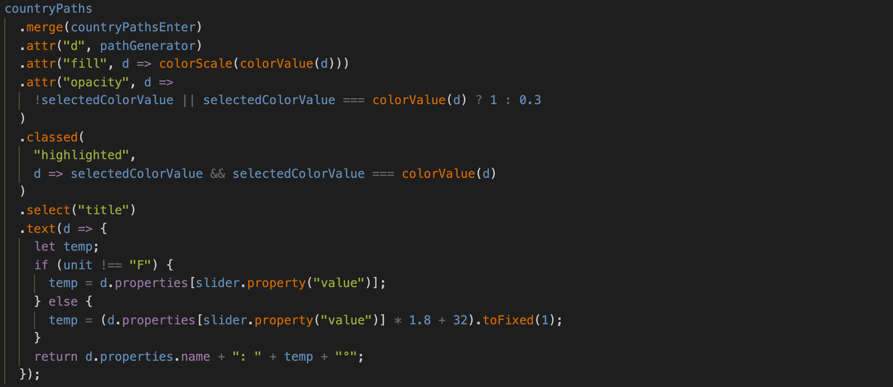

# Temperature Change over Time

This interactive map displays a visual representation of temperature change over time, as measured by average annual temperature of each country. By placing this information into the visual context of a choropleth map, trends over time are more easily perceived. A viewer can use the color legend to filter countries by temperature range. Drag and zoom features allow the viewer to examine specific regions or view the entire globe at once. 

Data sourced from the [Climatic Research Unit](http://www.cru.uea.ac.uk/data) of University of East Anglia.

This project was inspired by a world map visualization created by [Curran Kelleher](https://gist.github.com/curran). 

## Technologies

### Languages
* JavaScript
* HTML5
* CSS

### Libraries and Extensions
* D3.js
* TopoJSON
* World-Atlas

## Features

This project uses an ordinal color scale to depict temperature ranges. The decision to use the schemeSpectral color theme was based on the fact that it mirrors a heat map and allows for intuitive understanding of the temperature scale. Even without reading the color legend, a viewer can perceive a general trend in average temperatures throughout the world. The temperature ranges were chosen based on the highest and lowest temperatures in the dataset, and equally divided into ten categories. 

The map renders differently for each year 1901 through 2014. The temperature values are accessed based on the current value of the year slider. The ranges were given an alphabetical categorization so that the JavaScript native .sort() method would return a legend in numerical order. 

For readability and reusability, this project uses modular design principles. Larger functions are extracted into separate files, while customizable parts of the code occur within the render() function in index.js.

Promise.all() is used to load all necessary data, along with .then() syntax to compile the data into a singular variable for ease of use throughout the application. 

The viewer can interact with the map in a variety of ways. Depending on the viewer's preferred unit of temperature measurement, they can toggle between Celsius and Fahrenheit. Upon selecting a unit, the color legend and country tooltips will update to show the average temperature in the selected unit type. The unit selection is passed through the render function as a single letter: "C" or "F". A conditional statement is then used to display the correct data. Additionally, the viewer can select a specific temperature range, which will provide a visual filter on the map emphasizing all countries that fall within the selected temperature range. 

